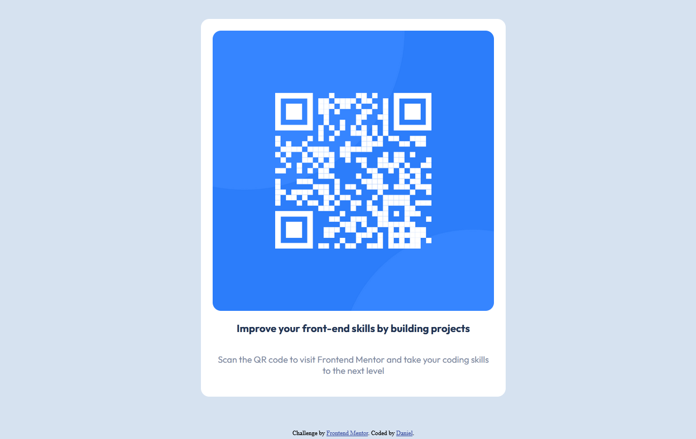

# Frontend Mentor - QR code component solution

This is a solution to the [QR code component challenge on Frontend Mentor](https://www.frontendmentor.io/challenges/qr-code-component-iux_sIO_H). Frontend Mentor challenges help you improve your coding skills by building realistic projects. 

## Table of contents

- [Overview](#overview)
  - [Screenshot](#screenshot)
  - [Links](#links)
- [My process](#my-process)
  - [Built with](#built-with)
- [Author](#author)
- [Acknowledgments](#acknowledgments)

## Overview

This is my first challenge at Frontend Mentor.
### Screenshot

### Links

- Solution URL: [https://github.com/Dantescur/frontend-masters/tree/main/qr-code-component-main/](https://github.com/Dantescur/frontend-masters/tree/main/qr-code-component-main/)
- Live Site URL: [https://amazing-giraffe.surge.sh/](https://amazing-giraffe.surge.sh/)

## My process

### Built with

- Semantic HTML5 markup
- CSS custom properties
- Flexbox
- Mobile-first workflow

## Author

- Website - [C. Daniel](https://pers-portf.vercel.app/)
- Frontend Mentor - [@Dantescur](https://www.frontendmentor.io/profile/Dantescur)
